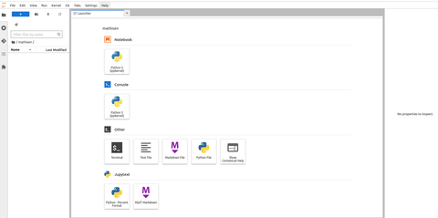
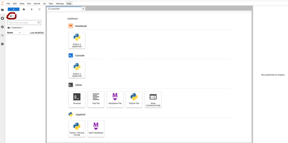
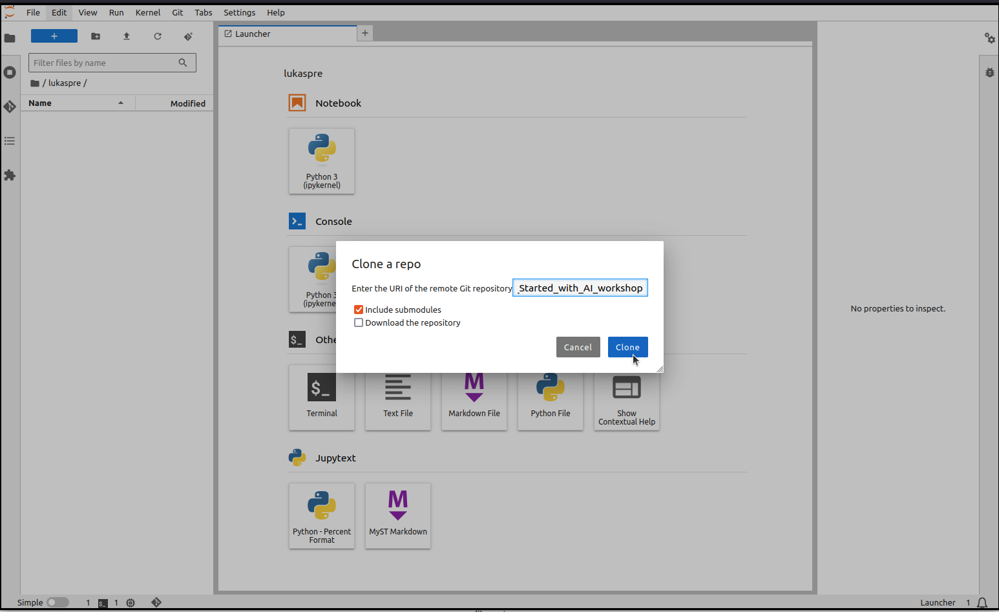

# Cloning the course git repository using JupyterLab UI

1. Open a JupyterLab session using the Jupyter app on the LUMI web interface [www.lumi.csc.fi](https://www.lumi.csc.fi)

    Follow the instructions in the second part of the exercise for this session. You can then keep using the session
    for the rest of the exercise.

2. Once you have opened JupyterLab and opened your own folder in the navigation panel to the left, your browser should a view like this (in this case for user `mathisen`):
    

3. Use the highlighted button to open the UI popup for cloning a git repository:

    

4. Enter the repository URL ( [https://github.com/Lumi-supercomputer/Getting_Started_with_AI_workshop](https://github.com/Lumi-supercomputer/Getting_Started_with_AI_workshop) ) and press the "Clone" button.

    

    This will clone the respository in a new folder "Getting_Started_with_AI_workshop" in your directory on the course project scratch filesystem.
