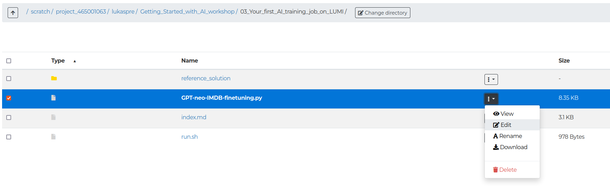

# 03 Your first AI training job on LUMI

## Hands-on exercises

1. Familiarise yourself with the training script.

   As a first exercise, familiarise yourself with the training script and understand how it is working. You do not need to make any changes to the file at this point.

   1. Check the training script [03_Your_first_AI_training_job_on_LUMI/GPT-neo-IMDB-finetuning.py](GPT-neo-IMDB-finetuning.py).

        You can open it via
        - the built-in editor of the [LUMI web interface](https://lumi.csc.fi) file explorer: 
        - any command line editor from a login node shell, either via the [LUMI web interface](https://lumi.csc.fi) or an [SSH connection](https://docs.lumi-supercomputer.eu/firststeps/loggingin/).
        - the Visual Studio Code app in the LUMI web interface (use the `interactive` partition)

2. Create a slurm batch file and start a training run.

    Next you will prepare the slurm batch file that specifies the resources required for the training, sets up the software environment and, finally, executes the training script on a compute node in a singularity container environment.

    In the same directory as the script you can find [03_Your_first_AI_training_job_on_LUMI/run.sh](run.sh), an incomplete slurm batch job file.

    1. Fill in the missing pieces (marked with `<!!! ACTION REQUIRED ... !!!>`).

        You should specify at least the following:
        - the correct slurm partition
        - number of CPUs requested
        - number of GPUs requested (1)
        - RAM requested
        - requested runtime (recommended: 15 minutes, so you can continue with sub-exercise 4 below)

        It can also be helpful to specify a name for the slurm logfile that contains the command line outputs of the script.

        The Python command needs to be run in a singularity container with the required software packages installed. The slurm batch file sets up a variable `CONTAINER`
        with the path to the container you should use.

        For the Python script itself you will need to provide the following command line arguments:
        - `--output-path` (for the trained model and checkpoints)
        - `--logging-path` (for tensorboard logging data)
        - `--model-name` (a name under which the model produced by the run will be stored; optional)
        - `--num-workers` (optional, is used to set the number of PyTorch dataloader processes)

        Please set the paths to some destination of your choice within your `/scratch/project_465001707/<username>` directory.

        > **Tip**
        >
        > The script sets environment variables `OUTPUT_DIR` and `LOGGING_DIR` with suggested paths you can use
        > for storing the trained model as well as tensorboard logging data.

        > **Tip**
        >
        > Slurm sets the environment variable `SLURM_CPUS_PER_TASK` to the value of allocated CPU cores per task, which
        > can be useful for setting `--num-workers`.

    2. Start the training using `sbatch run.sh` from a login node shell (LUMI web interface or SSH).

        You can continue with the remaining exercises below while the training proceeds.

3. Check your job.

    1. From a login node shell, use the slurm command `squeue --me` to check that your job is running. You can use the `tail -f` command to check the outputs of the job from the slurm log file `/03_Your_first_AI_training_job_on_LUMI/slurm-<jobid>.out` that is created once the job is running.

        You can also check your active jobs from the LUMI web interface: Navigate to Jobs > Active Jobs.

        > **Note**
        >
        > We will cover more details about checking the status and progress of your job in a later exercise.

4. Modify the script to enable it to continue from a checkpoint.

    Using checkpoints can be helpful to recover from failing runs (either due to errors encountered in your code or due to hardware or scheduler issues) without losing all your progress. It also allows to split your total training into smaller pieces that are more likely to pass through the scheduler queue quickly.

    The script currently already writes checkpoints but always starts training with from the basic GPT-neo model (i.e., it ignores previously written checkpoints).

    1. Change the training script so it can load a checkpoint from a previously interrupted training run and resume training. Check the [documentation about HuggingFace Trainer](https://huggingface.co/docs/transformers/main_classes/trainer) for guidance on this.

        You may want to add additional command line arguments to control this behaviour from the slurm batch script.

    2. Your earlier training job should by now have timed out without completing the training. Use your modified script to resume training from the last checkpoint.

        > **Important**
        >
        > Make sure to use the same `MODEL_NAME` (and paths) when resuming training from the checkpoint.

        > **Note**
        >
        > If your earlier training job is still running, you can stop it using the `scancel` command.

## Solutions

The folder `reference_solution/` contains an example solution for this exercise parts 1 and 2. `reference_solution/resume_from_checkpoint/` additionally contains the changes for part 4
