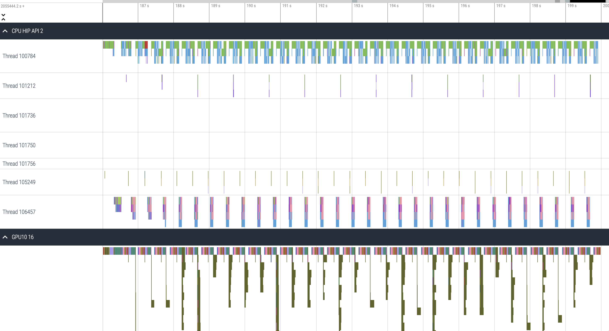

# 10 Extreme scale AI

These examples are based on the Pytorch container provided to you to do training at:
```
/appl/local/containers/sif-images/lumi-pytorch-rocm-5.6.1-python-3.10-pytorch-v2.2.2.sif 
```
This container was extended with some components required by the examples, notoriously the HuggingFace transformers module, resulting in the container in:
```
/scratch/project_465001063/containers/pytorch_transformers.sif
```

The examples also assume there is an allocation in place to be used for one or more nodes. That could be accomplished with, e.g.:
```
 N=2 ; salloc -p standard-g  --threads-per-core 1 --exclusive -N $N --gpus $((N*8)) -t 1:00:00 --mem 0
```
We'll also leverage the configuration for singularity provided by:
```
module purge
module use /appl/local/training/modules/AI-20240529/
module load singularity-userfilesystems singularity-CPEbits
``` 

With the allocation and container set we can do a quick smoke test to make sure Pytorch can detect the GPUs available in a node:
```
srun singularity exec \
    /scratch/project_465001063/containers/pytorch_transformers.sif \
    bash -c '$WITH_CONDA ; \
             python -c "import torch; print(torch.cuda.device_count())"'
```
Each node of the allocation should report `8` GPUs available.

## Things to consider when scaling up a training model

If you have a model that already uses multiple GPUs, scaling it further should not require modifications. It should just work accross nodes as it does accross a node.

However, there are a few performance implications that result from how GPUs are rigged inside the node: 


One of the corollary of this image has to do with the CPU binding to match the GPUs, which we already know we can accomplish with the SLURM option:
```
CPU_BIND_MASKS="0x00fe000000000000,0xfe00000000000000,0x0000000000fe0000,0x00000000fe000000,0x00000000000000fe,0x000000000000fe00,0x000000fe00000000,0x0000fe0000000000"

--cpu-bind=mask_cpu=$CPU_BIND_MASKS 
```

You see GPUs connect directly to the high-speed interfaces to comunicate with GPUs in other nodes. The communication library used by most AI applications is RCCL and it is a good idea to tell RCCL what interfaces it should use. This can be accomplished with:
```
export NCCL_SOCKET_IFNAME=hsn0,hsn1,hsn2,hsn3
```
We should also direct RCCL to do GPU RDMA whenever it can with:
```
export NCCL_NET_GDR_LEVEL=PHB
```

The other aspect to this is that RCCL needs to be able to comunicate with the network provider. When the application starts, RCCL will look for plugins that it could leverage to effect this communication. In the LUMI case we leverage AWS CXI plugin that has been hipified to support AMD GPUs: https://github.com/ROCm/aws-ofi-rccl.

Luckily, if you use the containers provided, this plugin is already available there so you don't need to worry about it. However, if you get some container from the internet most likely it won't have it so you need to be careful under the penalty of your scaling accross nodes being poor. There are a few environment variables that can help inform us on what RCCL is doing, e.g.:
```
export NCCL_DEBUG=INFO 
export NCCL_DEBUG_SUBSYS=INIT,COLL
export NCCL_DEBUG_FILE=/tmp/$(whoami)-rccl-rank$SLURM_PROCID.txt
```
This will produce information for the initialization of RCCL as well as the execution of collectives. It is also a good idea to direct this information to a file with `NCCL_DEBUG_FILE` as stdout performance might start affecting progress.

As we learned before, there is a master rank which is going to coordinate the execution and all ranks must know who that is. When we were using a single node we did: 
```
export MASTER_ADDR=$(hostname)
```
However, with multiple nodes this is not good enough as all ranks, regardless of the node, need to know what is the first node of the allocation. Luckily, SLURM can help. We can get the first node of an allocation with:
```
export MASTER_ADDR=$(scontrol show hostname "$SLURM_NODELIST" | head -n1)
```
Note, however, there are no SLURM tools inside the container, so the master address must be defined outside the container and propagated inside.

Another aspect that we should consider when scalling is to direct the cache folders of some of the libraries, namely MIOpen. MIOpen provides many optimized AI kernels and does just-in-time compilation which results are cached in your home folder by default. With many nodes racing for that cache, the file system might not cope with locks required, so we recommend setting it to each node `/tmp`. If your application relies heavily on these caches you can save them at the end of your job execution and reinstante it at the begginning of your next job.

Selecting different cache locations is fairly easy by setting the environment variables:

```
export MIOPEN_USER_DB_PATH="/tmp/$(whoami)-miopen-cache-$SLURM_NODEID"
export MIOPEN_CUSTOM_CACHE_DIR=$MIOPEN_USER_DB_PATH
```

## LLM hands-on exercises

We'll continue with our LLM example to explore our scaling oportunities. You might be interested in collating the different steps in a batch script or run interactively as presented. But first...

### 1. Setting some wrapper scripts is a great idea!

There are a lot of components to set and monitor the right environment for our training jobs as discussed above. Setup a wrapper script with all the relevant bits so that then you allow yourself to forget about it. Here's how to set one:

```
cat > wrapper.sh << EOF
#!/bin/bash -e

# Report affinity
echo "Rank \$SLURM_PROCID --> \$(taskset -p \$\$)"

# Report GPUs
if [ \$SLURM_LOCALID -eq 0 ] ; then
    rocm-smi
else
  sleep 2
fi

# Start conda environment inside the container
\$WITH_CONDA

# Setting the caches relevant to our application.
export TORCH_HOME=/workdir/torch-cache
export HF_HOME=/workdir/hf-cache
export TOKENIZERS_PARALLELISM=false

# Tell RCCL to use only Slingshot interfaces and GPU RDMA
export NCCL_SOCKET_IFNAME=hsn0,hsn1,hsn2,hsn3
export NCCL_NET_GDR_LEVEL=PHB

# Tell MIOpen where to store its cache
export MIOPEN_USER_DB_PATH="/tmp/$(whoami)-miopen-cache-\$SLURM_NODEID"
export MIOPEN_CUSTOM_CACHE_DIR=\$MIOPEN_USER_DB_PATH

if [ \$SLURM_LOCALID -eq 0 ] ; then
  rm -rf \$MIOPEN_USER_DB_PATH
  mkdir -p \$MIOPEN_USER_DB_PATH    
else
  sleep 2
fi

# export NCCL_DEBUG=INFO 
# export NCCL_DEBUG_SUBSYS=INIT,COLL
# export NCCL_DEBUG_FILE=/tmp/$(whoami)-rccl-rank\$SLURM_PROCID.txt

# Translate SLURM environment 

export MASTER_PORT=25900
export WORLD_SIZE=\$SLURM_NPROCS
export LOCAL_WORLD_SIZE=8
export RANK=\$SLURM_PROCID
export LOCAL_RANK=\$SLURM_LOCALID

set -x

# Run application
eval "\$@"

EOF
chmod +x wrapper.sh
```

Let's take a look on what is going on here from top to bottom:
* We leverage the `taskset` tool to report the affinity of the current process. This allows us to verify we are getting the affinity we expect.
* Then, we report the GPUs available using rocm-smi. This is a smoke test that the GPUs are up and running. We do this only for the first rank in a node - that rank will have `SLURM_LOCALID` set to `0`.
* Then, we settup our conda environment as well as a fewother environment variables to control the Pytorch and HuggingFace caches for our application.
* Then we configure RCCL to use the high-speed interfaces as well as GPU RDMA.
* Next step is the MIOpen cache. We also have the first rank in each node creating the cache folder. Note that, this is not used by our LLM application as it doesn't use MIOpen kernels. However, it doesn't do any harm and we'll keep you covered for other models you might want to train.
* Then, there are a few RCCL environment variables that you may chose to uncomment so as to get logging of the RCCL activity.
* Next, we translate the SLURM environment to something that Pytorch distributed module understands.
* Finally, the arguments of the wrapper scripts are expanded and executed.

### 2. Scalling our LLM example.

Let's recover our multiple GPU LLM training application:
```
curl -o GPT-neo-IMDB-finetuning-mp.py -L https://raw.githubusercontent.com/Lumi-supercomputer/Getting_Started_with_AI_workshop/main/08_Scaling_to_multiple_GPUs/reference_solution/GPT-neo-IMDB-finetuning.py
```
The only change we will do is selecting a different thread multiprocessing strategy. We will add:
```
    torch.multiprocessing.set_start_method('spawn') 
```
right after:
```
if __name__ == "__main__":  
```
This is meant to workaround an issue in Pytorch around the registration of threads (https://github.com/pytorch/pytorch/issues/119845). The need for this will be revisited after next scheduled update.

Now we can run in a single node:
```
MASTER_ADDR=$(scontrol show hostname "$SLURM_NODELIST" | head -n1) \
srun -N1 -n8 --gpus 8 \
    --cpu-bind=mask_cpu=0x00fe000000000000,0xfe00000000000000,0x0000000000fe0000,0x00000000fe000000,0x00000000000000fe,0x000000000000fe00,0x000000fe00000000,0x0000fe0000000000\
    singularity exec \
    -B .:/workdir \
    /scratch/project_465001063/containers/pytorch_transformers.sif \
    /workdir/wrapper.sh \
        python -u /workdir/GPT-neo-IMDB-finetuning-mp.py \
               --model-name gpt-imdb-model \
               --output-path /workdir/train-output \
               --logging-path /workdir/train-logging \
               --num-workers 7
```
or in a couple of nodes:
```
MASTER_ADDR=$(scontrol show hostname "$SLURM_NODELIST" | head -n1) \
srun -N2 -n16 --gpus 16 \
    --cpu-bind=mask_cpu=0x00fe000000000000,0xfe00000000000000,0x0000000000fe0000,0x00000000fe000000,0x00000000000000fe,0x000000000000fe00,0x000000fe00000000,0x0000fe0000000000\
    singularity exec \
    -B .:/workdir \
    /scratch/project_465001063/containers/pytorch_transformers.sif \
    /workdir/wrapper.sh \
        python -u /workdir/GPT-neo-IMDB-finetuning-mp.py \
               --model-name gpt-imdb-model \
               --output-path /workdir/train-output \
               --logging-path /workdir/train-logging \
               --num-workers 7
```

### 3. Monitoring GPU activity

We can monitor activity as before. However, if you want to use the profiler when multiple ranks are being run, it makes more sense to profile a few selected ones, otherwise will be too much overhead. Most AI training is balanced, so what we see in a rank can be extrapolated to others.

To profile just a single rank you can create a copy of your wrapper script, let's call it `wrapper-profile.sh` and replace the last `eval` command with:
```
pcmd=''
if [ $RANK -eq 14 ] then
  pcmd='rocprof --hip-trace --stats'
fi

eval "$pcmd $@"
```  
this will only profile rank number 14. You could select any other rank. 
We can now use the same strategy as before to profile just 32 steps and then run with:
```
MASTER_ADDR=$(scontrol show hostname "$SLURM_NODELIST" | head -n1) \
srun -N2 -n16 --gpus 16 \
    --cpu-bind=mask_cpu=0x00fe000000000000,0xfe00000000000000,0x0000000000fe0000,0x00000000fe000000,0x00000000000000fe,0x000000000000fe00,0x000000fe00000000,0x0000fe0000000000\
    singularity exec \
    -B .:/workdir \
    /scratch/project_465001063/containers/pytorch_transformers.sif \
    /workdir/wrapper-profile.sh \
        python -u /workdir/GPT-neo-IMDB-finetuning-mp.py \
               --model-name gpt-imdb-model \
               --output-path /workdir/train-output \
               --logging-path /workdir/train-logging \
               --num-workers 7
```
The resulting profile for the 32 steps would look like:


Zooming in, we can see the RCCL activity. The moment these kernels dominate the profile we start to be network bound.


## Computer vision hands-on exercises:

Large language models is one of the main usecases in production these days. However, applications from computer vision are still relevant. The good news is that a lot of the same concepts discussed before can be easily applied to run this application.

### 1. Preparing our computer vision example
Let's grab one of the official pytorch examples for image classification:
```
curl -L \
  -o cv_example.py \
  https://raw.githubusercontent.com/pytorch/examples/main/imagenet/main.py
```
Let's just add the same fix as before by adding:
```
torch.multiprocessing.set_start_method('spawn') 
```
right after:
```
def main():
```

### 2. Know where the data lives

We have downloaded in advance the data set as that is a time consuming process. The image classification labels are controlled by the folder namming of the data set that contains many files in a compressed image format. To be able to make quicker progress, we also created a trimmed down version of the data-set with just a fraction of the classes.

Here's how the data is organized:
* Full set in scratch storage:
    * /scratch/project_465001063/data-sets/data-resnet
* Reduced set in scratch storage:
    * /scratch/project_465001063/data-sets/data-resnet-small

* Full set in flash storage:
    * /flash/project_465001063/data-sets/data-resnet
* Reduced set in flash storage:
    * /flash/project_465001063/data-sets/data-resnet-small

* Tarball and HDF5 containers for the data set:
    * /flash/project_465001063/data-sets/data-resnet.tar
    * /flash/project_465001063/data-sets/data-resnet-small.tar
    * /flash/project_465001063/data-sets/data-resnet.hdf5

The containers are useful to move the data around as it is much faster to move a single large file rather than many small files. E.g. is better untar a container than copy an expanded dataset from elsewhere.

### 3. Training at scale
We are ready to run with one or more nodes (adjust `N` for the number of nodes) just by issuing:

```
N=1 ; \
srun -N $N -n $((N*8)) --gpus $((N*8)) \
    --cpu-bind=mask_cpu=0x00fe000000000000,0xfe00000000000000,0x0000000000fe0000,0x00000000fe000000,0x00000000000000fe,0x000000000000fe00,0x000000fe00000000,0x0000fe0000000000\
    singularity exec \
    -B .:/workdir \
    /scratch/project_465001063/containers/pytorch_transformers.sif \
    /workdir/wrapper.sh \
        python -u /workdir/cv_example.py \
          -a resnet50 \
          --batch-size $((8*512)) \
          --workers $((8*7))  \
          --gpu \$SLURM_LOCALID \
          --world-size \$SLURM_NPROCS \
          --rank \$SLURM_PROCID \
          --dist-url "tcp://$(scontrol show hostname "$SLURM_NODELIST" | head -n1):45678" \
          --dist-backend 'nccl' \
          --epochs 2 \
          /flash/project_465001063/data-sets/data-resnet-small
```
Here we are doing training using ResNet-50 over 2 epochs with 512 batch-size per GPU. We use the same 7 workers as before. The dataset is given by the last argument - we use the small data set but you are free to try the complete one. The other arguments are similar to what we used before to translate information from the SLURM environment.

### 4. Monitor GPU activity

This example leverage MIOpen, so you check if `/tmp/$(whoami)-miopen-cache-$SLURM_NODEID` being populated with the MIOpen databases in each node. Start a parallel SLURM session to that effect.

Then, try monitor the GPU activity as before. You should be able to see snapshots such as this:

```
======================= ROCm System Management Interface =======================
================================= Concise Info =================================
GPU  Temp   AvgPwr  SCLK     MCLK     Fan  Perf    PwrCap  VRAM%  GPU%
0    42.0c  128.0W  1650Mhz  1600Mhz  0%   manual  500.0W   78%   100%
1    43.0c  N/A     1650Mhz  1600Mhz  0%   manual  0.0W     78%   100%
2    38.0c  132.0W  1650Mhz  1600Mhz  0%   manual  500.0W   78%   100%
3    49.0c  N/A     1650Mhz  1600Mhz  0%   manual  0.0W     78%   100%
4    41.0c  111.0W  800Mhz   1600Mhz  0%   manual  500.0W   78%   0%
5    43.0c  N/A     1650Mhz  1600Mhz  0%   manual  0.0W     78%   100%
6    45.0c  130.0W  1650Mhz  1600Mhz  0%   manual  500.0W   78%   100%
7    47.0c  N/A     1650Mhz  1600Mhz  0%   manual  0.0W     78%   100%
================================================================================
============================= End of ROCm SMI Log ==============================
```
It is like some GPUs are intermitently idle holding everyone else back. This is related with some I/O bottlenecks, as images have the potential of putting more strain on the filesystem. We'll learn about that in the next session.

## Distributed training frameworks hands-on exercise

Several frameworks for distributed training have been developed for different purposes and different levels of integration in the serial section of the model. E.g. Horovod (https://horovod.ai/) supply an MPI-like approach to control sharing of data and providing wrappers for the local operations of the most popular AI frameworks like Pytorch and TensorFlow. Others, like DeepSpeed (https://github.com/microsoft/DeepSpeed) offer more optimized distributed operations tailored for specific problems/optimizers, being widely used in LLM. It also offer computer vision optimizations. 

### 1. Prepare DeepSpeed example
We can try one of the DeepSpeed examples on our setup similar to our computer vision example:
```
curl -L -o cv_example_ds.py \
https://raw.githubusercontent.com/microsoft/DeepSpeedExamples/master/training/imagenet/main.py

curl -LO \
https://raw.githubusercontent.com/microsoft/DeepSpeedExamples/master/training/imagenet/config/ds_fp16_z1_config.json
```
Parse the files to create some understanding of the differences.

### 2. Running DeepSpeed with required dependencies 
This container has DeepSpeed already installed so we will leverage it: `/appl/local/containers/sif-images/lumi-pytorch-rocm-5.6.1-python-3.10-pytorch-v2.2.2.sif`.

You can run the example like the following, however some dependencies might be missing. Can you install those? Can you setup the `spawn` multiprocessing mode?
```
N=2 ; \  
MASTER_ADDR=$(scontrol show hostname "$SLURM_NODELIST" | head -n1) \
srun -N $N -n $((N*8)) --gpus $((N*8)) \
    --cpu-bind=mask_cpu=0x00fe000000000000,0xfe00000000000000,0x0000000000fe0000,0x00000000fe000000,0x00000000000000fe,0x000000000000fe00,0x000000fe00000000,0x0000fe0000000000\
    singularity exec \
    -B .:/workdir \
    /appl/local/containers/sif-images/lumi-pytorch-rocm-5.6.1-python-3.10-pytorch-v2.2.2.sif  \
    /workdir/wrapper.sh \
        python -u /workdir/cv_example_ds.py \
          --deepspeed \
          --deepspeed_config /workdir/ds_fp16_z1_config.json \
          -a resnet50 \
          --batch-size $((8*512)) \
          --workers 7  \
          --gpu \$SLURM_LOCALID \
          --local_rank \$SLURM_LOCALID \
          --world-size \$SLURM_NPROCS \
          --epochs 2 \
          /flash/project_465001063/data-sets/data-resnet-small
```
Note that, in spite of this being a similar example to what we tested before the options and their meaning changed a bit. E.g. the number of worker is per GPU in this case.


## I/O considerations hands-on exercise

In our computer vision example. We experienced the I/O limits - we aimed at using flash storage. If one would have used scratch storage it would have been worse. However, the limits of flash storage wouldn't have let us have the complete set of files. So there are always tradeoffs we have to observe.

### 1. Play with datasets and training models

You are welcome to try larger data-sets and from different storage types to see how that affects the training. The largest the model more time the initialization will take as the labels are being processed. You can also select smaller models, like Resnet-18, so that you make things less GPU-bound and observe more easily the challenges around the data input pipeline.

### 2. Prestage in memory

If limited by I/O, we could try in-memory storage. LUMI nodes don't have local SSD but have significant ammount of memory, so that could be sufficient for your needs. To store data in memory it is sufficient to do it as files under `/tmp` as that lives in memory. So we can do:
```
srun tar -C /tmp -xf /flash/project_465001063/data-sets/data-resnet-small.tar 
```
to expand the trimmed down data set into memory and then we can just our model training there:
```
N=1 ; \    
srun -N $N -n $((N*8)) --gpus $((N*8)) \
    --cpu-bind=mask_cpu=0x00fe000000000000,0xfe00000000000000,0x0000000000fe0000,0x00000000fe000000,0x00000000000000fe,0x000000000000fe00,0x000000fe00000000,0x0000fe0000000000\
    singularity exec \
    -B .:/workdir \
    /scratch/project_465001063/containers/pytorch_transformers.sif \
    /workdir/wrapper.sh \
        python -u /workdir/cv_example.py \
          -a resnet50 \
          --batch-size $((8*512)) \
          --workers $((8*7))  \
          --gpu \$SLURM_LOCALID \
          --world-size \$SLURM_NPROCS \
          --rank \$SLURM_PROCID \
          --dist-url "tcp://$(scontrol show hostname "$SLURM_NODELIST" | head -n1):45678" \
          --dist-backend 'nccl' \
          --epochs 2 \
          /tmp/data-resnet
```
### 3. Monitor GPU activity
Try monitor the activity and scale to more nodes. You see the training completes much faster as the I/O pipeline can keep up with the GPU demands.

Note however, that in general, when scalling goes up, one tends to start using smaller batch sizes, which means less work per GPU, which can bring us back to an I/O bottleneck situation.

## Preprocessing pipeline exercises - stay-tuned

Also, while scaling up and the GPUs start being less busy with the batch compute, you might expose other bottlenecks in the data input pipeline. Not only file-system I/O happens, it can be followed by a more or less complex data preprocessing pipeline before the data, say an image, is turned into a tensor to be consumed by the optimizer. In this situation you might be interested in investigating solutions that also speedup this pipeline in GPU. For image processing, AMD developed the ROCm Augmentation Library (rocAL). This is an opensource project that you can check in https://github.com/ROCm/rocAL. This links also shows a table with the transformations supported.

The following is possible in recent ROCm installs. However, on LUMI it doesn't because of the graph support by the driver.
```
curl -L -o cv_example_rocal.py https://raw.githubusercontent.com/ROCm/rocAL/develop/docs/examples/pytorch/imagenet_training/imagenet_training.py
```

```
N=1 ; \    
srun -N $N -n $((N*8)) --gpus $((N*8)) \
    --cpu-bind=mask_cpu=0x00fe000000000000,0xfe00000000000000,0x0000000000fe0000,0x00000000fe000000,0x00000000000000fe,0x000000000000fe00,0x000000fe00000000,0x0000fe0000000000\
    singularity exec \
    -B .:/workdir \
    /pfs/lustrep4/scratch/project_465001063/containers/lumi-pytorch-rocm-5.6.1-python-3.10-pytorch-v2.2.2-rocal-0046624.sif \
    /workdir/wrapper.sh \
        python -u /workdir/cv_example_rocal.py \
          -a resnet50 \
          --batch-size $((8*512)) \
          --workers $((8*7))  \
          --gpu \$SLURM_LOCALID \
          --world-size \$SLURM_NPROCS \
          --rank \$SLURM_PROCID \
          --dist-url "tcp://$(scontrol show hostname "$SLURM_NODELIST" | head -n1):45678" \
          --dist-backend 'nccl' \
          --epochs 2 \
          --rocal-gpu \
          /tmp/data-resnet
```
